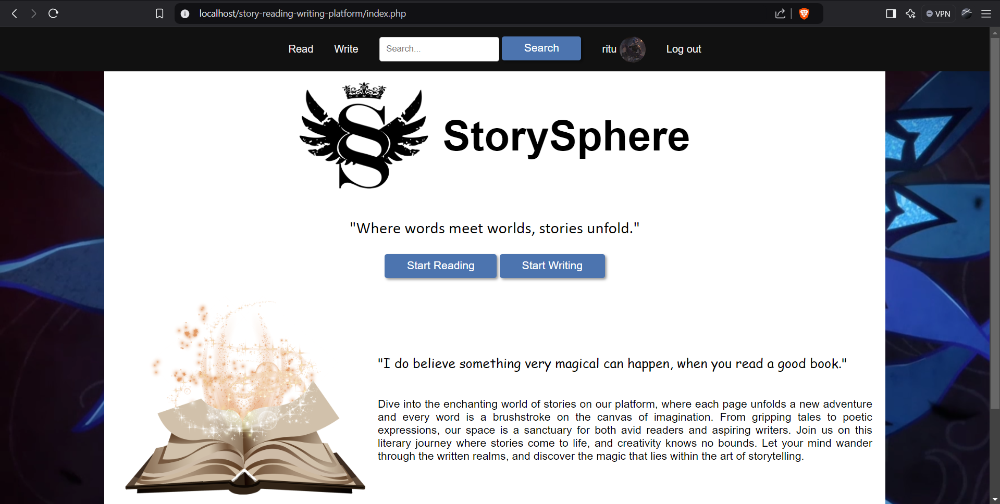
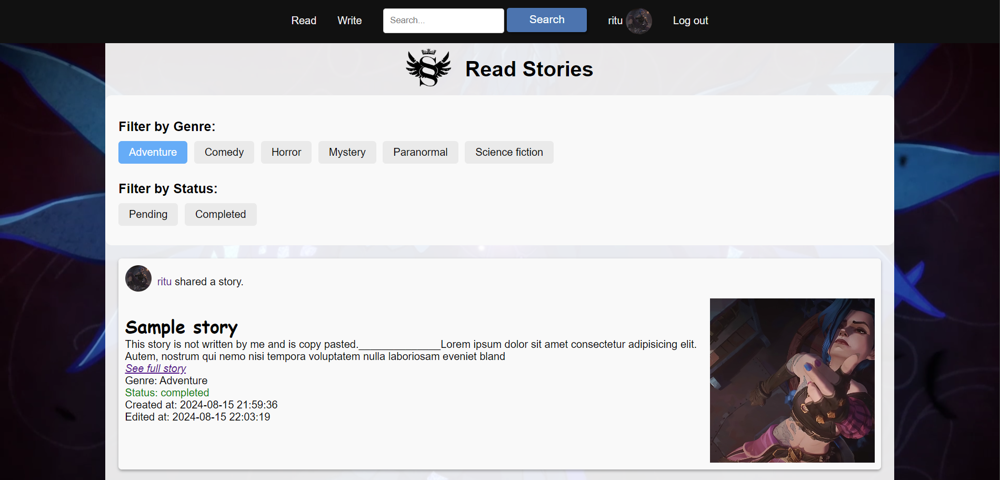
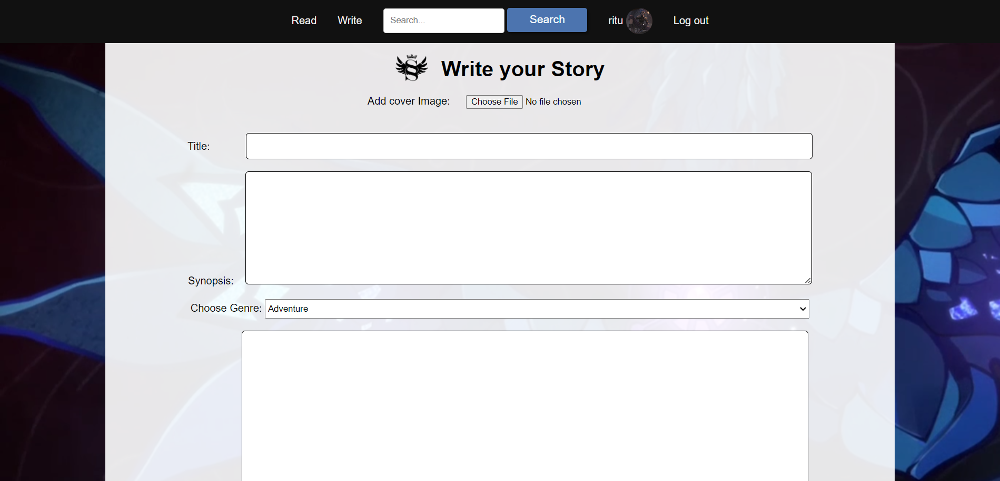
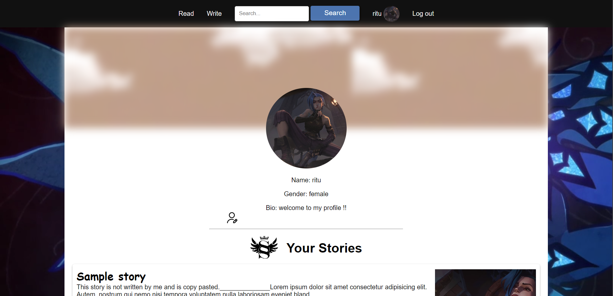
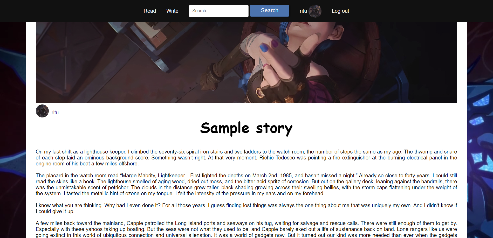
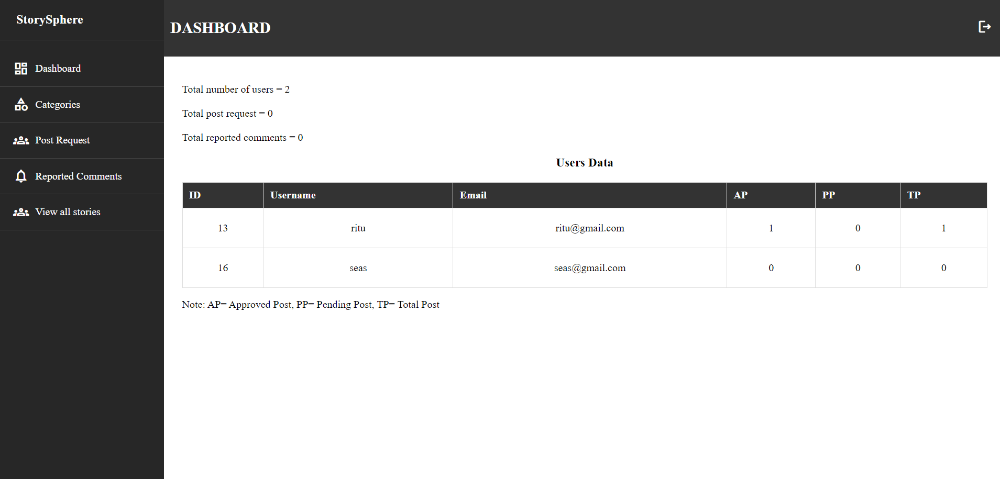

## Project Showcase

Index page:

read page:

write page

profile page

full story page

Admin page:

 

## Description

- This project was created from scratch as a **college project**, which includes **CRUD operations** and **validations**.
- It does **not implement any algorithms**.
- The **frontend** is built using:
  - `HTML`
  - `CSS`
  - `JavaScript`
- The **backend** is implemented using:
  - `PHP`
